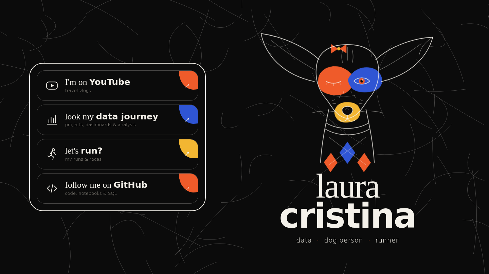
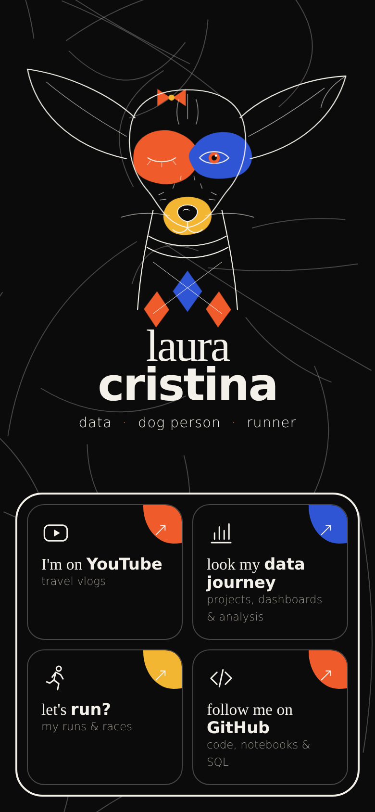

# lauracristina.dev

> **data · dog person · runner**: my personal link page, live at **[lauracristina.dev](https://lauracristina.dev)**.



A single-screen landing page that links to everything I do: travel vlogs on YouTube, my data journey, my runs and my code. The hero illustration is my dog, drawn in SVG with thin line art and flat color shapes.

<p align="center">
  
</p>

## ✨ Features

- **One screen, no scroll**: responsive layout for desktop, tablet and phone
- **Hand-drawn SVG dog** that winks, wiggles her bow and follows your cursor with her open eye
- **Generative background**: thin line art drawn with JavaScript on every load
- **Four link cards** with a color blob that fills the card on hover
- Custom circle cursor and a `prefers-reduced-motion` fallback
- Plain HTML, CSS and JavaScript: **no frameworks, no build step, no dependencies**

## 🗂️ Project structure

```
lauracristina.dev/
├── index.html            # page markup + inline SVG illustration
├── assets/
│   ├── css/style.css     # colors, layout, animations, responsive rules
│   ├── js/script.js      # background lines, cursor, eye tracking
│   ├── img/favicon.svg
│   └── preview/          # screenshots used in this README
├── CNAME                 # custom domain for GitHub Pages
└── .nojekyll             # serve files as-is on GitHub Pages
```

## 🎨 Design

| Token    | Value     |
|----------|-----------|
| Black    | `#0b0b0b` |
| Ink      | `#f4f1ea` |
| Orange   | `#ef5b2a` |
| Blue     | `#2f55d4` |
| Yellow   | `#f2b632` |

Typography: **Fraunces** (light serif) + **Outfit** (extra-bold sans), via Google Fonts.
Visual direction inspired by bold-color / fine-line editorial portfolio designs.

## 🚀 Run locally

No install needed. Open `index.html` in your browser, or use the **Live Server** extension in VS Code for auto-reload.

## 🌐 Deploy

Hosted for free on **GitHub Pages** (Settings → Pages → Deploy from branch `main` / root), with the custom domain set in `CNAME`.

## 📬 Contact

- YouTube: [@YOUR_CHANNEL](https://www.youtube.com/@YOUR_CHANNEL)
- LinkedIn: [YOUR_USER](https://www.linkedin.com/in/YOUR_USER)
- GitHub: [@LuaCristina](https://github.com/LuaCristina)
- Email: llauracss@gmail.com

---

Made with data, coffee and the best dog in the world 🐾
